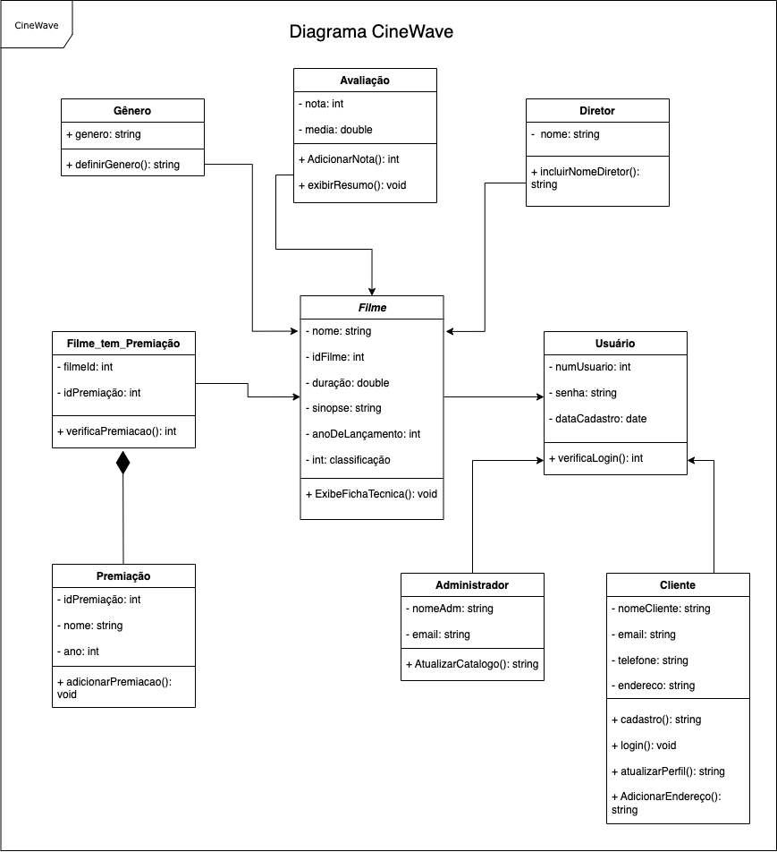

# Arquitetura da Solução

Pré-requisitos: <a href="3-Projeto de Interface.md"> Projeto de Interface</a>

Definição de como o software é estruturado em termos dos componentes que fazem parte da solução e do ambiente de hospedagem da aplicação.

## Diagrama de Classes

O diagrama de classes ilustra graficamente como será a estrutura do software, e como cada uma das classes da sua estrutura estarão interligadas. Essas classes servem de modelo para materializar os objetos que executarão na memória.

## Modelo ER (Projeto Conceitual)

O Modelo ER, abreviação para Modelo de Entidade e Relacionamento, é uma ferramenta essencial no campo de gerenciamento de bancos de dados, especialmente durante a fase de projeto conceitual. Ele desempenha um papel crucial na representação e organização de dados em sistemas de informação, fornecendo uma abstração clara e independente da tecnologia que ajuda na compreensão e comunicação de como os dados são estruturados e relacionados dentro de um sistema.

### Entidades Principais

No contexto do nosso sistema, identificamos três entidades principais que desempenham papéis cruciais na modelagem dos dados:

- Usuário: A entidade Usuário representa os indivíduos que interagem com a plataforma. Cada usuário possui atributos como ID de Usuário, Nome de Usuário, Senha, E-mail, entre outros. Esses atributos são essenciais para a autenticação e identificação dos usuários no sistema.

- Filme: A entidade Filme representa os filmes disponíveis na plataforma. Cada filme é caracterizado por atributos como ID de Filme, Título, Sipnose e Poster. Esses atributos ajudam a descrever os detalhes específicos de cada filme em nossa base de dados.

- Lista de Filmes: A entidade Lista de Filmes é usada para organizar os filmes de acordo com as preferências dos usuários. Cada lista possui atributos como ID da Lista, Nome da Lista. Elas permitem que os usuários criem e gerenciem coleções personalizadas de filmes.

### Atributos das Entidades

Cada entidade possui um conjunto específico de atributos que descrevem as características e propriedades associadas a ela. Esses atributos são cruciais para a representação e manipulação dos dados. Alguns dos atributos relevantes incluem:

- Usuário: ID de Usuário, Nome de Usuário, Senha, E-mail, etc.
- Filme: ID de Filme, Título, Sinopse, Poster, etc.
- Lista de Filmes: ID da Lista, Nome da Lista, etc.

### Relacionamentos

A estrutura do Modelo ER é definida por relacionamentos que conectam as entidades. Os principais relacionamentos no nosso sistema são:

- Relacionamento "Usuário - Lista de Filmes" (1 para N):

  * Cada usuário pode criar várias listas de filmes.
  * Cada lista de filmes pertence a um único usuário.

- Relacionamento "Lista de Filmes - Filme" (N para N):

  * Cada lista de filmes pode conter vários filmes.
  * Um filme pode estar em várias listas de diferentes usuários.

Para gerenciar o relacionamento "Lista de Filmes - Filme" de forma eficiente, utilizamos uma tabela de junção chamada "FilmeLista". Essa tabela permite a associação de filmes a listas específicas de usuários, tornando possível a criação de coleções personalizadas de filmes.

## Projeto da Base de Dados

O projeto da base de dados corresponde à representação das entidades e relacionamentos identificadas no Modelo ER, no formato de tabelas, com colunas e chaves primárias/estrangeiras necessárias para representar corretamente as restrições de integridade.

Tabela: Usuario
Colunas:
ID (chave primária)
username
nome
email
senha

Tabela: Lista
Colunas:
ID (chave primária)
UserID (chave estrangeira referenciando a tabela Usuario)

Tabela: Filme
Colunas:
ID (chave primária)
titulo
poster
sinopse

Tabela: FilmeLista (para representar o relacionamento N:N entre Filme e Lista)
Colunas:
ListaID (chave estrangeira referenciando a tabela Lista)
FilmeID (chave estrangeira referenciando a tabela Filme)
marcar_como_assistido
dar_nota (valor de 0 a 100)
fazer_review
curtir
discutir

A tabela "Usuario" armazena informações sobre os usuários, como ID, nome de usuário, nome, email e senha.
A tabela "Lista" armazena informações sobre as listas criadas pelos usuários e possui uma chave estrangeira (UserID) que se relaciona com a tabela "Usuario" para rastrear qual usuário criou a lista.
A tabela "Filme" armazena informações sobre os filmes, como ID, título, poster e sinopse.
A tabela "FilmeLista" é usada para representar a relação N:N entre filmes e listas de reprodução. Ela armazena informações sobre a interação de um filme em uma lista, como se ele foi marcado como assistido, a nota dada, a revisão feita, etc. Ela também possui chaves estrangeiras (ListaID e FilmeID) que se relacionam com as tabelas "Lista" e "Filme", respectivamente.

## Tecnologias Utilizadas

Descreva aqui qual(is) tecnologias você vai usar para resolver o seu problema, ou seja, implementar a sua solução. Liste todas as tecnologias envolvidas, linguagens a serem utilizadas, serviços web, frameworks, bibliotecas, IDEs de desenvolvimento, e ferramentas.

Apresente também uma figura explicando como as tecnologias estão relacionadas ou como uma interação do usuário com o sistema vai ser conduzida, por onde ela passa até retornar uma resposta ao usuário.

## Hospedagem

Explique como a hospedagem e o lançamento da plataforma foi feita.

> **Links Úteis**:
>
> - [Website com GitHub Pages](https://pages.github.com/)
> - [Programação colaborativa com Repl.it](https://repl.it/)
> - [Getting Started with Heroku](https://devcenter.heroku.com/start)
> - [Publicando Seu Site No Heroku](http://pythonclub.com.br/publicando-seu-hello-world-no-heroku.html)
